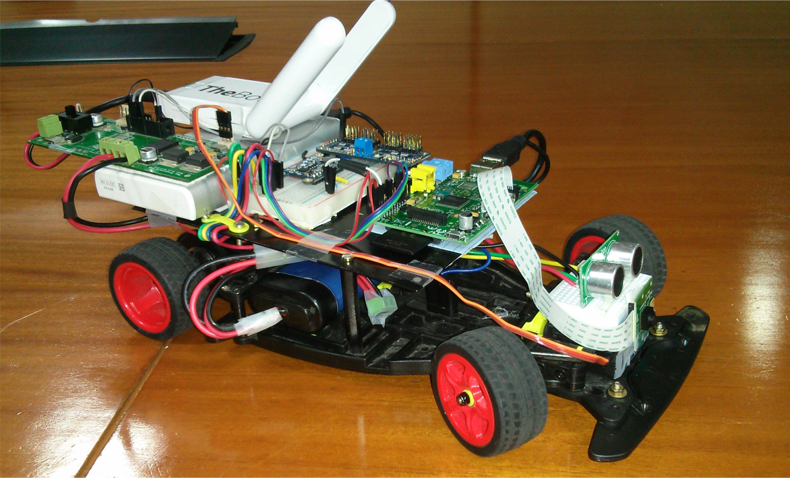
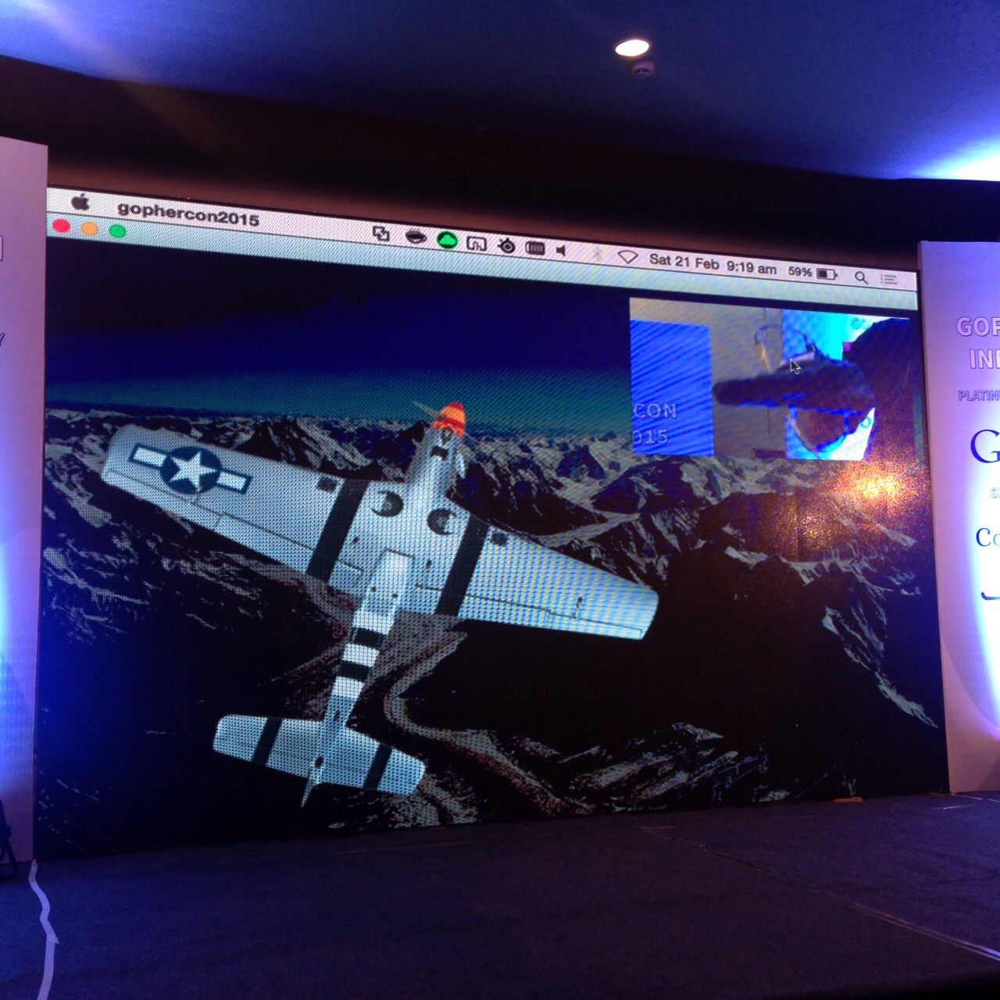

Kunal Powar (@\_poWar\_) is currently a developer at [SoStronk](https://www.sostronk.com/). Prior to this he has worked as an application developer at [ThoughtWorks](http://www.thoughtworks.com/) for almost two years. That's where he started his journey with Go. This talk is about EMBD which is also his first serious implementation with Go.

Kunal starts by explaining EMBD as a Embedded Programming Framework written completely in Go. He also explains the term **Embedded Programming** by using a Raspberry Pi as an example. A Raspberry Pi exposes GPIO(General Purpose Input Output) pins which can be used to interface with other external components, thus making it a Embedded Device. The coding one would have to do on such a device so that it works with the outer system is Embedded Programming.

He then talk about the start of EMBD. His former employer ThoughtWorks had a initiative called "Open Hardware" where interested people gathered to build hardware projects to learn the technology involved and make it Open Source. Kunal and one of his Colleague [Karan](http://kidoman.io/) wanted to build a Bot, which can be controlled using any Smart phone with accelerometers connected to the network. They decided to use Raspberry Pi as the main control unit for the Bot. Kunal started out by using existing Python libraries to control the GPIO. But Karan having worked with Go for a long time, asked him to try Go instead. At first Kunal hesitated as he had to learn a new language. But after going through 20 slides of [tour.go](https://tour.golang.org/welcome/1) as suggested by Karan, he was interested to experiment with the language. As of any first hardware project, they used Go to control a LED connected to one of the Pins, And that's how EMBD started. The slide shows the final look of the Bot that they built using EMBD.

Kunal then moves on to show a demo of how a typical EMBD application would work. His contraption has a Glove on which there's a Gyro sensor which is connected to a Raspberry Pi. He wears the glove and starts the application. A Airplane rendered using a Qt application pans and rolls following the orientation of his palm.

For the demo, a EMBD code is running on the Raspberry Pi 2 listening for readings from the sensor and sending them over a TCP port using [mangos](https://github.com/gdamore/mangos)(a scalability protocol written in Go). This information is sent to a Qt app written by his colleague [Shantanu](http://blog.shantanu.io/). The app uses [nanomsg](http://nanomsg.org/) to listen on the TCP port and renders the airplane's attitude using the sensor data.

Kunal uses this demo as a example to show how EMBD can be used as a quick prototyping solution for hardware projects. Embedded Programming is best done using C/C++ for its performance trumps everything else. But lets say you have a brilliant idea in the field of IOT. You would want something with which you can quickly prototype and see if your idea is feasible. This is where EMBD will be the best choice, as it exposes a simple hardware abstraction layer so that you can concentrate more on the Application/Idea than the actual coding required. He points out that once you got your prototype working with EMBD, you can then care about fabricating custom hardware and coding using C.

In the rest of his talk, Kunal tries to answer the question **Why and How did they use GO for EMBD?**. These are points he talks about Go which inspired him to use it.
* Easy to learn and use.
    - Kunal comes from Electronics background. He always had a overhead of learning the language semantics and would sometimes be lost enough to forget what he was working on. But Go was a different experience for him. Learning the language was the easiest part.
* Growing community of Gophers.
    - The huge and expanding community of gophers made it apt for EMBD which was open sourced right from its inception. They've already had several pull requests by the community.
* Cross Platform
* Static Binary
    - One of Kunal's favorite feature with Go was the ability to generate a single static binary for target architecture. He explains how once their code compiled on the MAC they'd just use the GOOS and GOARCH variables to build a executable for the Pi.
* Lots of features which made sense in Hardware realm.
    - Kunal uses few examples to show how some features were best fit for EMBD.

###Interfaces

He starts by explaining about a hardware component called [Servo](http://en.wikipedia.org/wiki/Servomotor) as something similar to a motor but with restricted motion. Servos are used to provide steering action in most robotic cars. He also explains about [PWM](http://en.wikipedia.org/wiki/Pulse-width_modulation) which is a square wave whose pulse width can be changed. A Servo takes PWM as input to rotate its shaft to a specific angle. Now he shows how they modeled a servo in EMBD

PWM interface  
(https://github.com/kidoman/embd/blob/master/motion/servo/servo.go - line 20:22)

Servo Struct  
(https://github.com/kidoman/embd/blob/master/motion/servo/servo.go - line 24:28)

Servo method to set angle  
(https://github.com/kidoman/embd/blob/master/motion/servo/servo.go - line 40:46)

To explain why PWM is a interface, He talks about how PWM is a signal which can be generated using different methods. He uses snippets from EMBD to show two such methods used.

Using [PCA9685](https://www.adafruit.com/datasheets/PCA9685.pdf)(12 channel PWM generator)  
(https://github.com/kidoman/embd/blob/master/samples/servo.go - line 21:32)

Using GPIO  
(https://github.com/kidoman/embd/blob/master/samples/pwm.go - line 20:28)

With this in context, he explains how a servo in real world does not really care about how the input PWM is generated. All it needs is a handle on its pulse width. So to enable the two PWM signals to be used as Servo's input, all they have to do is, implement the function **SetMicroseconds**. By doing this, those PWM signals or any other PWM is automatically a PWM interface type by Duck Typing. Kunal shares that this was the most elegant approach for implementing a Servo using interfaces.

###Channels and Goroutines

Kunal talks about how sensors work before explaining the usage of Channels and Goroutines. Sensors are devices that acquire data from surrounding and convert them into machine readable data. In a typical embedded application, you'd ask a sensor to give the reading and execute tasks related to that sensor. But every sensor takes a finite time to sample the data and give the result. So essentially, asking a sensor for reading is blocking in nature. Kunal tells how real time embedded applications cannot afford to block at any step in execution. So embedded code have a pattern where, whenever a sensor has data available, a code block that deals with the sensor is executed. He now explains how is this achieved in EMBD.

He shows a snippet from [L3GD20](http://www.adafruit.com/product/1714) package which is a gyro sensor. It gives orientation of the sensor with respect to 3 axes from its initial position. Its the same sensor he used in his demo.

L3GD20 Struct  
(https://github.com/kidoman/embd/blob/master/sensor/l3gd20/l3gd20.go line 114:125)

Start method  
(https://github.com/kidoman/embd/blob/master/sensor/l3gd20/l3gd20.go line 328:365)

Orientations  
(https://github.com/kidoman/embd/blob/master/sensor/l3gd20/l3gd20.go line 319:325)

In EMBD every sensor package follows the same pattern. It exposes a Run or Start method which does initial setup and calibration if required, and then starts a go routine where the sensor is set on a data acquisition loop. It keeps sending the data over a channel whenever its available. Now to use this data, the sensor package exposes a Method which gives a receive-only channel. (in this case its **_Orientations_** )

With this pattern, the usage becomes fairly simple as shown.

(https://github.com/kidoman/embd/blob/master/samples/l3gd20.go line 21:51)

Kunal then talks briefly about the journey ahead for EMBD. He covers three main points.
* Support for more platforms 
* Adding driver support for more sensors
* Cover all hardware communication protocols